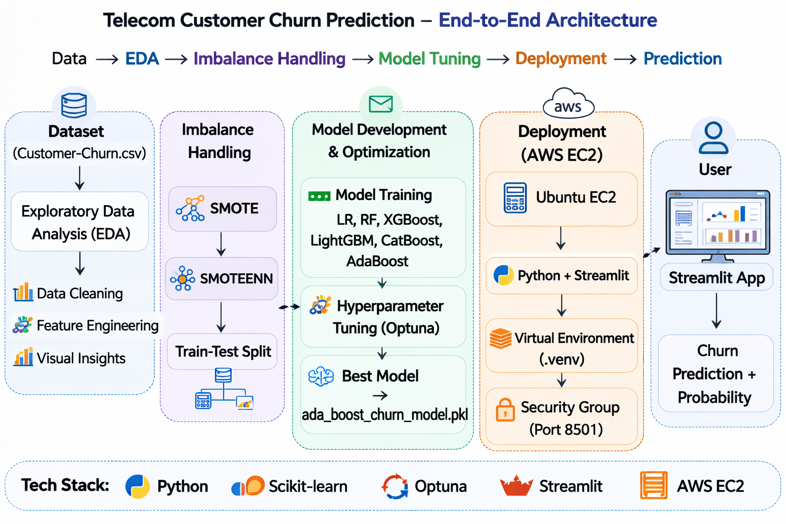

# 📊 Telecom Customer Churn Prediction using Machine Learning (Deployed on AWS EC2)

## 📌 Project Overview  
Customer churn is a critical business challenge in the telecom industry. Retaining customers is significantly more cost-effective than acquiring new ones. This project builds and deploys a machine learning model that predicts whether a telecom customer is likely to churn.

The solution includes:
-End-to-end data analysis
-Feature engineering
-Model development & evaluation
-Interactive web application (Streamlit)
-Cloud deployment on AWS EC2

🔗 Live Application: http://44.249.144.7:8501
(Server availability may vary depending on instance status.)

---

## 🎯 Business Problem

Telecom companies want to:
- Anticipate which customers are likely to churn
- Take proactive action (offers, discounts, improved service)
- Optimize marketing budgets
- Improve customer lifetime value

This solution predicts whether a customer will churn and provides a churn probability score that helps prioritization.

---

## 📦 Dataset

The project uses the **Telco Customer Churn dataset**, which includes:

| Feature Category | Example Variables |
|------------------|------------------|
| Customer Info | gender, senior citizen |
| Services Subscribed | internet, phone, streaming |
| Contract Details | contract type, tenure |
| Billing Info | monthly charges, total charges |
| Target | churn (Yes/No) |

---

## 🏗️ Architecture Diagram

Below is the high-level flow of the system:



---

## Tech Stack & Tools

💻 Programming
-Python

📊 Data Processing
-pandas
-numpy

🤖 Machine Learning
-scikit-learn
-imbalanced-learn (SMOTE, SMOTEENN)
-XGBoost
-LightGBM
-CatBoost
-Optuna

🌐 Web Application
-Streamlit

☁️ Cloud & Deployment
-AWS EC2
-Ubuntu Linux
-Python Virtual Environment (.venv)

---

## 🔍 Key Modules & Workflow

### 1. Data Analysis & Preprocessing ("The Investigation")

- Explored distributions, relationships, and churn indicators
- Handled missing/erroneous values
- Created derived features (e.g., tenure bins)
- Encoded categorical variables
- Scaled numerical features

---

### 2. Handling Class Imbalance ("The Balancing Act")

Imbalanced datasets can severely affect classifier performance. This project applies:
- **SMOTE (Synthetic Minority Over-sampling Technique)**
- **SMOTEENN (SMOTE + Edited Nearest Neighbors cleanup)**

This improves model learning on churn class, which is typically underrepresented.

---

### 3. Model Development & Optimization ("The Prediction Engine")

Multiple models were trained and compared:
- Logistic Regression  
- Random Forest  
- XGBoost  
- LightGBM  
- CatBoost  
- AdaBoost  

**Final model selected:**  
🚀 **Optimized AdaBoostClassifier**

Hyperparameters were tuned using **Optuna**, a modern automated optimization framework that efficiently discovers the best configuration.

The final trained model is saved as:


---

### 4. Application Development ("The Product")

An interactive web application was built using **Streamlit**, allowing users to:

- Input customer information
- Get churn prediction (Yes/No)
- View churn probability
- Trigger backend preprocessing & inference

The app uses the **same preprocessing pipeline** as the trained model to ensure consistency.

---

## ☁️ Deployment (AWS EC2)

The application is deployed on an **AWS EC2 Ubuntu instance** using the following steps:

1. Launch an EC2 instance (Ubuntu)
2. Set up a Python virtual environment
3. Clone the project repository
4. Install dependencies from `requirements.txt`
5. Run Streamlit as a background service using `nohup`:

```bash
nohup python3 -m streamlit run streamlit_app.py \
    --server.port 8501 \
    --server.address 0.0.0.0 \
    > app.log 2>&1 &

---

## Model Performance & Business Impact
📈 Performance Highlights:
-Improved recall for churn class using SMOTEENN
-Optimized hyperparameters via Optuna
-Robust generalization on unseen data
-Probability-based churn risk scoring

💼 Business Impact
This system enables telecom companies to:
-Identify high-risk customers early
-Reduce customer attrition
-Optimize retention campaigns
-Improve revenue forecasting
-Increase customer lifetime value

---

## Future Improvements:
Add SHAP explainability dashboard
Containerize application using Docker
Deploy behind Nginx reverse proxy
Add CI/CD pipeline (GitHub Actions)
Integrate monitoring & logging
Auto-scaling infrastructure
Convert to REST API (FastAPI backend)

